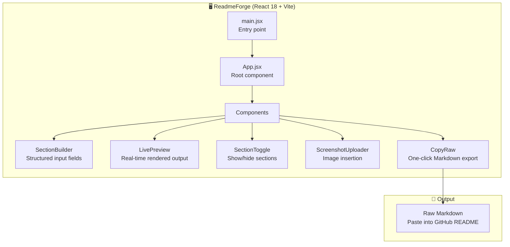

# ReadmeForge — Architecture Overview

> A contributor-focused guide to how ReadmeForge is structured and how its parts fit together.

---

## System Diagram

---

## Layer by Layer

### Entry Point
`index.html` is the root HTML template. `src/main.jsx` mounts the React app into it.

### App Component — `src/App.jsx`
The root component. Manages global state — which sections are toggled, current field values, and uploaded screenshots. Passes data down to builder and preview components.

### Components — `src/`
All UI lives here as modular React components:

| Component | Purpose |
|---|---|
| Section Builder | Structured input fields for each README section |
| Live Preview | Renders the generated Markdown in real time |
| Section Toggle | Lets users include/exclude sections |
| Screenshot Uploader | Handles image insertion into the README |
| Copy Raw | Exports the final Markdown with one click |

### No Backend
ReadmeForge is entirely client-side. There is no server, no database, and no API calls. All state lives in React during the session.

---

## Key Files for New Contributors

| File | Why it matters |
|---|---|
| `src/main.jsx` | Entry point — mounts the React app |
| `src/App.jsx` | Root component — owns all global state |
| `src/` | All components live here |
| `vite.config.js` | Vite configuration — bundler settings |
| `index.html` | Root HTML template |
| `package.json` | Dependencies and npm scripts |

---

## Adding a New Section

1. Add the input field in the Section Builder component
2. Add the toggle in Section Toggle
3. Update the Markdown template in the export logic
4. Test in the Live Preview — it updates in real time